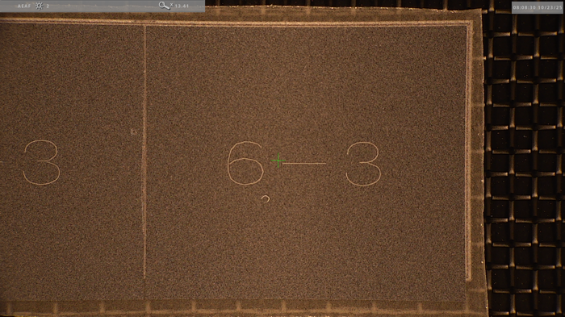

# TFPX-101 Module Gluing

`Introduction Placeholder`

## Required Materials

General Comments

  - [ ] Add pictures of all required materials
  - [ ] The phrasing should be imperative: Rather than "We conduct detailed inspection...", say to the reader "Conduct a detailed inspection..."

- Module components
    - Pre-production HDI
    - Sensor-ROC Assembly (SRA, ROC: Readout chip)
- Gluing materials
    - Glue
    - Mixing nozzle
    - Stencil
    - Glue spreader (e.g. plastic card)
- Equipment
    - Gantry
    - 1x2 module assembly gantry tooling
    - Gelpak vacuum tooling
    - High precision scale
    - Microscope

## Procedure

### Step 1: Inspect parts

Upon receiving new components, we conduct a detailed inspection of the SRAs to spot for any damage done prior to our handling of the components/module. Any damage done after this point will ideally be easier to pinpoint to a specific mishandling or part of our procedure that can be learned from and avoided in the future. A sufficient inspection entails pictures of both sides of the SRA that would capture any chips or scratches. Any noticeable damage to the HDI should also be documented. 

The picture of the SRA can be done with either a microscope or the gantry camera. Here is an example of a set that captures the entire SRA using the microscope.

||Chip 12|Chip 13|
|-|-|-|
|ROC Side|||
|Sensor Side|||

Here is a method for taking these that minimizes handling:
- Put on nitrile gloves in addition to required cleanroom apparel
- Image whatever side faces up in the gelpak **Caleb: should be more proscriptive, "Image the sensor side of the SRA"**
- Put gelpak on the gelpak vacuum release tooling and turn on the vacuum line  **Caleb: How does one turn on the vacuum line?**
- Pick up the SRA with a vacuum pen and place it in your gloved hand palm up
- Flip the SRA with the rubber lip of the vacuum pen
- Place the SRA back in the gelpak with the vacuum pen and turn off the vacuum line
- Image other side

**Caleb: We should confirm that we are required to image both sides of the SRA. I feel like we would spot 95% of issues by imaging just the sensor side, and this flipping procedure seems to introduce extra handling that could be avoided.**

### Step 2: Weigh parts

To know how much glue was used to adhere the module together, we weigh the components before the assembly and the module after assembly, and subtract the difference. Using the vacuum pen, safely transfer the components to the high precision scale and record their masses one at a time.

**Caleb: Be more specific. What exactly are the steps. Do you need to press any buttons on the scale? Do you wait for the reading to stabilize, for how long? To what precision do you record the measurements? Which components are we measuring?**

### Step 3: Stage parts

Assuming the 1x2 module assembly tooling is already installed and calibrated, stage the SRA on the sensor launch chuck and the HDI on the HDI launch chuck with a vacuum pen. It should be connector side up for the HDI and sensor side up for the SRA. For the HDI, align the two screw holes in the HDI with the two screw holes on the right side of the chuck. For the SRA, we gently push it into the corner of the strips of kapton tape that we have placed on the chuck to help us align the center consistently. The wirebond pads on the ROC should be on the left side of the chuck. Below is a picture of the correct orientation for staging.

**Caleb: How can I know if the tooling is installed and calibrated? Are there any quick checks that can confirm this? Mention that if the HDI is noticibly warped, you can try to gently bend it so it lays flat on the chuck.**

INSERT PICTURE HERE

### Step 4: Run assembly script

We are now ready to run our gantry script. Open the gScript Interpreter, select to run in nonvirtual mode, click load script, and navigate to the assembly script. The current path for the assembly script is: 

`./gantry-config-bu/Scripts/TFPXModules/Pre-Production Scripts/Assemble_1x2_sensor.gscript`

Then click run script and follow the instructions in the pop-ups.

INSERT PICTURE OF FIDUCIALS HERE FOR REFERENCE (or add reference images to the script)

Once you arrive at the gluing step, place the HDI flipper tool HDI side up on the weight tool chuck. Ensure that the hose is fed perpendicularly to the right. Here are a sequence of pictures of the gluing process, which are explained below.

||||
|-|-|-|
|HDI PICTURE|STENCIL OVER HDI|GLUE LINE ON STENCIL|

Place the stencil over the HDI, making sure that the orientation is correct. The quickest way to check this is by making sure the thin strip on the side of the HDI lines up with the separated strip of holes on the stencil. Once the stencil is placed correctly, you can now put a mixing nozzle on the glue gun and deposit a line of glue at the bottom of the stencil. Then, slowly spread the glue upwards with the glue spreader until the last row of holes is passed. It is helpful to use your idle hand to hold the stencil down near the two holes to make sure the stencil doesn't lift off the HDI prematurely, especially when you lift the spreader off the stencil. Once you are done spreading the glue and the spreader has been lifted away from the stencil, grab the top and bottom of the stencil and lift it straight up off the HDI. The script will then do a survey of the glue pattern, which you should look at to ensure there is glue in all the spots there should be.

**Caleb: Add a reference image of the glue pattern for comparison**

You can now continue through the script until you have completed the final step of measuring the fiducials on the placed HDI. Lastly, save the assembly log file and glue survey image, both of which are found in the logs directory (`./gantry-config-bu/Logs/`).

### Step 5: Cure module

After the assembly script, you must let the glue cure for at least 8 hours. Make sure to leave the vacuum lines of both the assembly chuck and HDI flipper tool on. Also direct the hose of the weight tool upwards as seen in the picture below. Lastly, put a note next to the curing module saying "DO NOT TOUCH, GLUE CURING" or something along those lines so no one unknowingly interferes with this process.

INSERT PICTURE

### Step 6: Run survey script

After enough time as passed, load the survey script, which will measure the relative alignment of the two parts. That script is currently in the following location:

`./gantry-config-bu/Scripts/TFPXModules/Pre-Production Scripts/Survey_1x2_sensor.gscript`

Run the script and follow the prompts that pop-up. Select the precise option for measuring the fiducials. After the script completes, save the survey log file, which is found in the logs directory (`./gantry-config-bu/Logs/`).

### Step 7: Weigh module

You can now pick the module up with a vacuum pen and weigh the module with the high precision scale. Record the mass and subtract off the sum of the earlier measurements of the individual components. The result will be the weight of the total glue applied.

### Step 8: Update the Purdue DB

Log into the Purdue DB and navigate to the entry for the module you are currently assembling. Change the status to "Glued" and upload the assembly and survey log files to the notes section.

**Caleb: A bit more detail here since the Purdue database is not the most intuitive to use. At least mention which button to click from the home screen "Inspect part (read/write)".**

### Next steps

You can now screw the module into the module carrier using two M2.5 button-head screws. DO NOT TIGHTEN TOO HARD. They are only meant to hold the module in place, there should be no force exerted on the module from the screws. If the side opposite of the screws is lifted off the module carrier, then you have tightened the screws too much. At this point, you can now place the carrier on a module assembly chuck and continue with the spacer installation. Otherwise, it should be placed in the dry air cabinet until you are ready to install the spacer.
