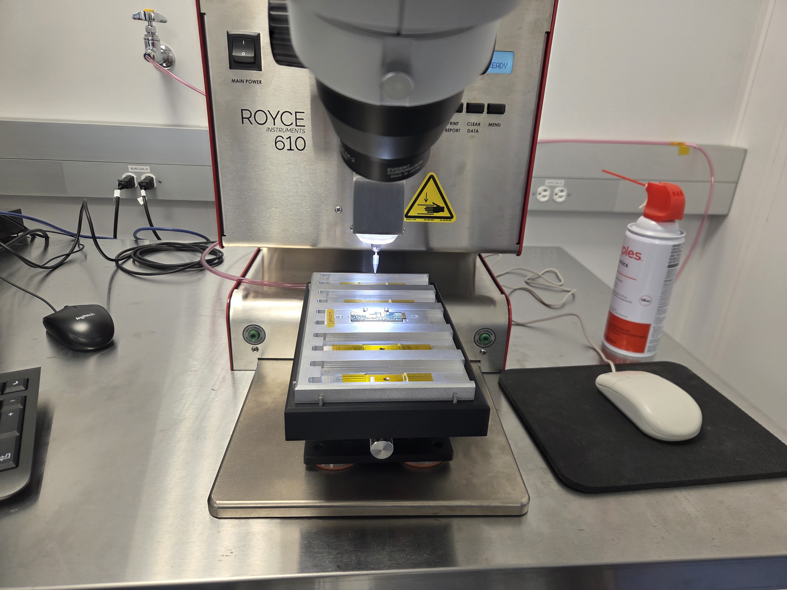
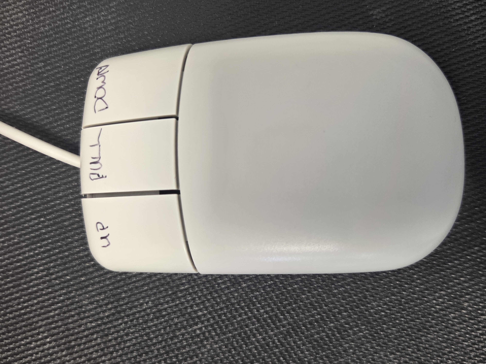
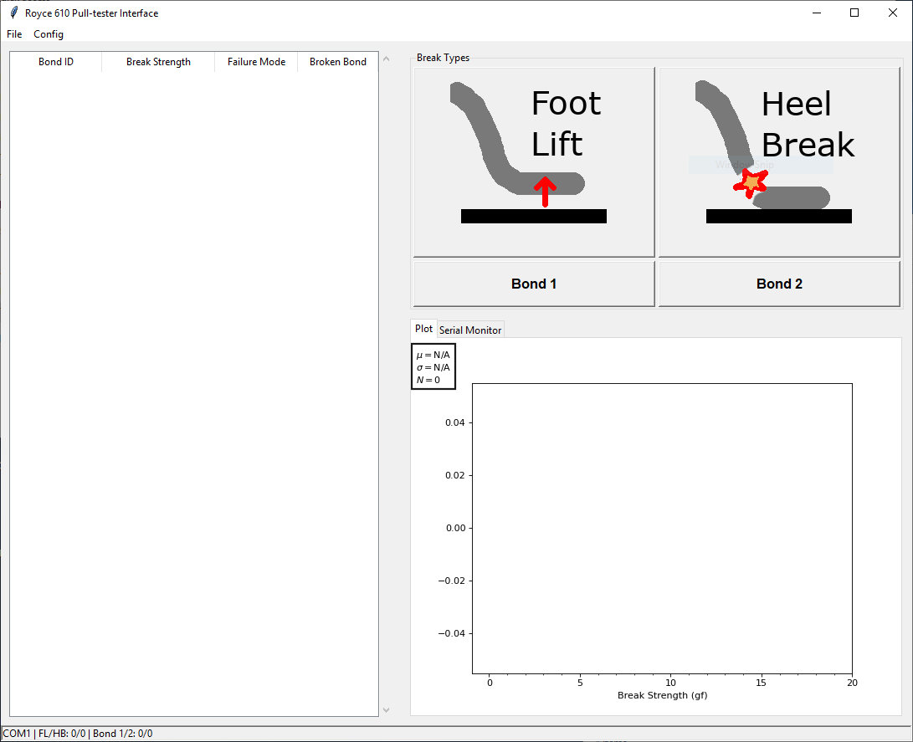
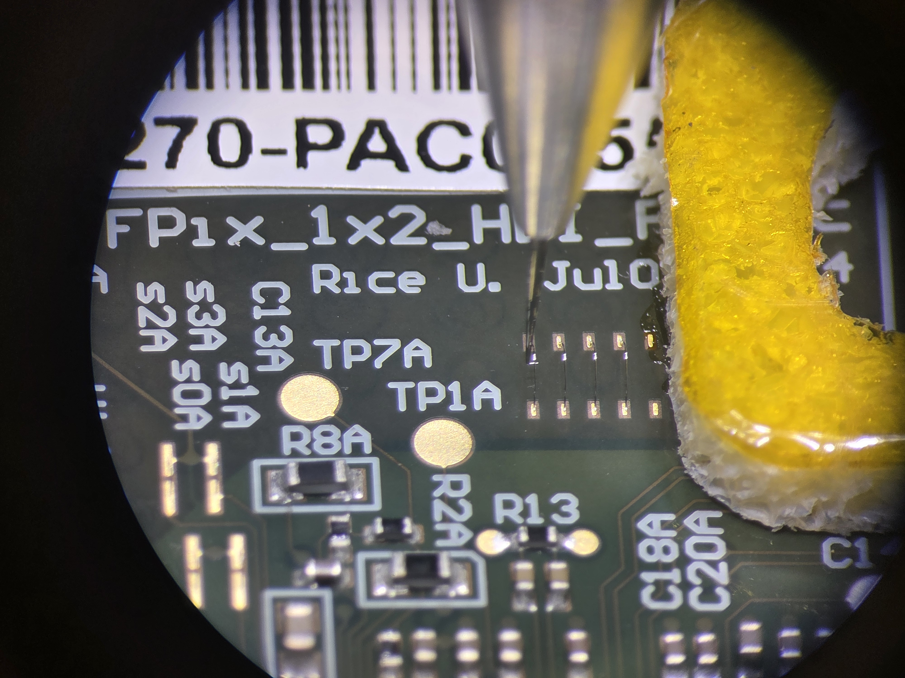
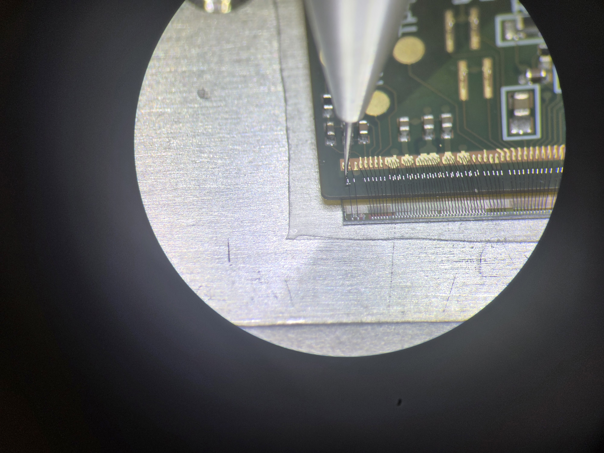
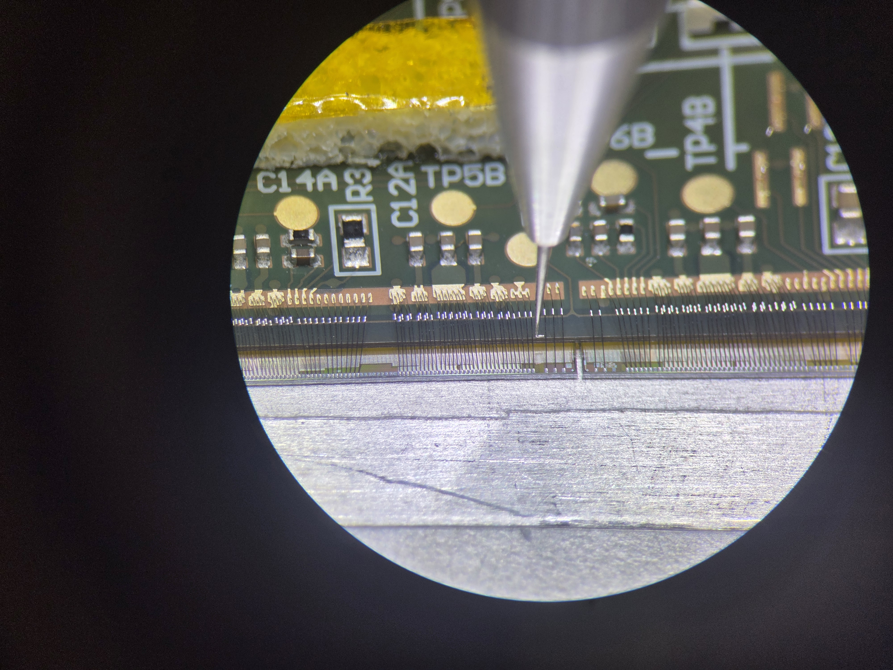
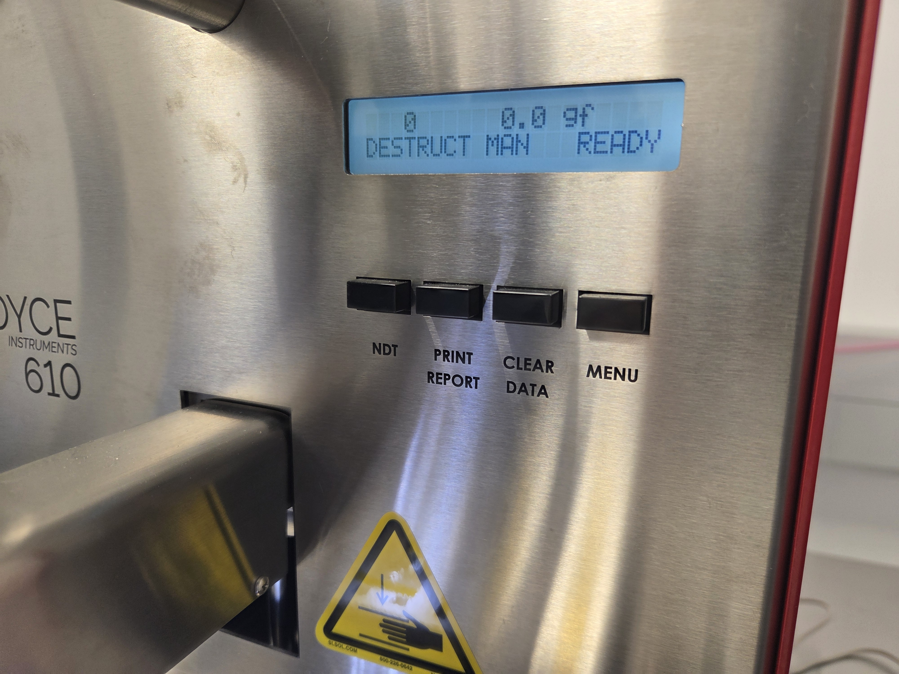

# TFPX-104 CROC 1x2 Module Pull Testing

This SOP describes how to use the Royce 610 bond pull tester to destructively test the dedicated pull-test wires and the unneeded trim-bit wires on a wire bonded CROC 1x2 sensor module. It also describes how to export the results, remove the broken wire remnants, and enter the measurements in the Purdue database.

## Required Materials

- Wire bonded CROC 1x2 module, with spacer, screwed to its assembly carrier
- TFPX 1x2 module pull-testing plate
- Royce 610 pull tester with hook tool and control computer
- Digital microscope
- Fine-point tweezers
- Vacuum source
- USB thumb drive
- Kimtech wipe
- Clean, dry compressed air (optional)

## Important Notes

- Pull testing is destructive. Pull only the dedicated pull-test wires and the trim-bit wires identified as unneeded in the Purdue database. **Never pull a functional HDI-to-ROC wire, bias wire, or required trim-bit wire.**
- Keep the module screwed to the assembly carrier throughout this procedure.
- The pull-test order matters because the exported results must be matched to individual wires. Complete one group in full before moving to the next group, and record the failure mode immediately after each pull.
- Keep hands clear of the moving test head and stage. Use the stage controls to position the module; do not reposition it by hand while the hook is near the module.
- This SOP does not define an acceptance threshold. Apply the currently approved project acceptance criteria when reviewing the recorded pull forces.

## Procedure

### Step 0: Identify the wires to be tested

Before placing the module in the pull tester, look up its serial number in the [Purdue database](https://www.physics.purdue.edu/cmsfpix/Phase2_Test/main.php). Note which trim-bit wires are unneeded. In the database trim-bit diagrams, pull the positions shown in **gray** and leave the positions shown in **red** intact.

The complete pull order is:

1. Four dedicated HDI-to-HDI pull-test wires, from left to right
2. Ten dedicated HDI-to-ROC pull-test wires, proceeding from chip 12 to chip 13:
    - Two on the left side of chip 12
    - Three on the right side of chip 12
    - Two on the left side of chip 13
    - Three on the right side of chip 13
3. Only the unneeded trim-bit wires identified in the Purdue database

### Step 1: Stage the module

1. Check the pull-tester software and the Royce 610 display to confirm that no measurements from a previous module remain. If data are present, first verify that they have already been saved, then select **File -> Clear Data** in the software and press the physical **CLEAR DATA** button on the Royce 610, if needed. Confirm that the measurement count is zero before continuing.
2. Verify that the module is still secured to its assembly carrier.
3. Slide the assembly carrier into the TFPX 1x2 module pull-testing plate.
4. Place the plate on the pull tester stage and push the corner into the metal pins, as shown below.
5. Turn on the stage vacuum and gently verify that the fixture cannot move.
6. Orient the module so that you can work on the selected wires without reaching the hook across intact wirebonds.

|Module staged in the Royce 610|
|-|
||

### Step 2: Position and focus the module

The three-button mouse controls the pull-test head:

- Left button: move the hook **up**
- Middle button: begin the **pull**
- Right button: move the hook **down**
- Move the mouse left or right: **rotate the hook** left or right

|Pull-tester mouse controls|
|-|
||

Use the stage controls to bring the first wire beneath the hook. Adjust the microscope position, focus, and illumination until both the wire and the hook are clearly visible. Move the mouse left or right as needed to rotate the hook into alignment with the wire. Lower the hook carefully, watching continuously through the microscope. Never lower it onto the HDI, ROC, bond pads, or neighboring wires.

### Step 3: Pull the dedicated test wires

For every wire:

1. Move the stage until the hook is centered beneath the wire loop. The hook should engage the wire near the middle of its span without touching either bond foot.
2. Use the right mouse button to lower the hook through the loop. Move the mouse left or right to rotate the hook into position, then make any small stage adjustment needed to center the wire on the hook.
3. Press the middle mouse button to perform the pull. Keep hands away from the moving stage and test head.
4. After the wire breaks, use the left mouse button to raise the hook to a safe clearance height.
5. While viewing the module through the microscope, use the pull-tester hook to gently bend the broken wire away from the intact wirebonds. Do this immediately after each pull so the remnant is easy to identify and remove during final cleanup. Do not drag the remnant across neighboring wires or bond pads.
6. Inspect both bond sites and immediately classify:
    - The failure mode, such as `foot lift` or `heel break`
    - Which bond failed: bond `1` or bond `2` (the first or second bond made)
7. Record the result in the pull-test software by selecting the illustrated **Foot Lift** or **Heel Break** failure mode and then selecting **Bond 1** or **Bond 2**. Use the diagrams in the software as a reference when identifying the failure mode. The result will appear in the table on the left with its bond ID, break strength, failure mode, and broken bond.
8. If the broken wire remains on the hook or still obstructs the next wire, use fine-point tweezers to move it aside without contacting any intact wirebond.

|Pull-test software and break-type reference|
|-|
||

The image below shows the hook correctly placed beneath a dedicated HDI-to-HDI pull-test wire.

|Hook beneath a pull-test wire|
|-|
||

Pull all four HDI-to-HDI wires from left to right. Then pull the ten HDI-to-ROC wires in the order given in Step 0. Do not skip around: the result sequence is used later to associate each force measurement with its wire location.

|HDI-to-ROC pull on the left side|HDI-to-ROC pull on the right side|
|-|-|
|||

### Step 4: Pull the unneeded trim-bit wires

Return to the trim-bit configuration recorded from the Purdue database in Step 0. Pull each **gray/unneeded** trim-bit wire. Leave every **red/required** trim-bit wire untouched. Record the pull force, failure mode, and failed bond for each wire just as for the dedicated pull-test wires.

When finished, compare the module with the database diagrams a second time and confirm that every required trim-bit wire remains in place.

### Step 5: Export and clear the data

1. On the pull-tester computer, select **File -> Save CSV**.
2. Save the data to the USB thumb drive using a filename that begins with the module serial number, for example:

    ```
    RH0142_PullTest.csv
    ```

3. Open or otherwise verify the saved file before clearing the instrument. Confirm that the file contains the expected number of measurements and that the measurements are in the order used above.
4. Select **File -> Clear Data** in the software.
5. Press the physical **CLEAR DATA** button on the Royce 610, if needed, and confirm that the instrument is ready for the next module.

|Royce 610 data controls|
|-|
||

### Step 6: Remove wire remnants

1. Raise the hook to a safe height.
2. Turn off the stage vacuum and remove the pull-testing plate.
3. Take the module, still attached to its assembly carrier, to the digital microscope.
4. Orient the carrier so that your hand and tweezers do not pass over intact wirebonds.
5. Use fine-point tweezers to remove loose or long remnants from every pulled wire. A nearby Kimtech wipe is useful for cleaning wire fragments from the tweezers.
6. If a loose fragment cannot be removed with tweezers, a brief, gentle burst of clean, dry compressed air may be used. Keep the can upright and far enough away to prevent condensation or a forceful blast onto the wirebonds.
7. Inspect every tested location. Only short bond feet should remain on the pads; there should be no loose fragments or long wire remnants.
8. Double-check the trim-bit pattern against the Purdue database and verify that all required trim-bit wires and all functional module wirebonds remain intact.

### Step 7: Update the Purdue database

Navigate to the Purdue database [login page](https://www.physics.purdue.edu/cmsfpix/Phase2_Test/main.php) and log in. Then:

1. Click **Inspect part (read/write)**.
2. Enter the module serial number in the **Serial #** field.
3. Click the search button.
4. Open the module entry and scroll to the **Add measurement** section.
5. Select `WB_PULL`.
6. Use the comment field to identify the measurement group exactly as follows (one at a time):
    - `HDI-HDI`
    - `HDI-ROC`
    - `Unneeded Trim Bits`
7. Click the "Add measurement" button, it will take you to a new page to enter in the data.
8. Add the measurements in the same order in which the wires were pulled and verify the entries against the exported CSV.
9. Repeat steps 5-8 for the other measurement groups.

## Next Steps

After all results have been saved and entered, return the module to the dry-air cabinet or proceed to testing-carrier assembly according to [TFPX-105 CROC 1X2 Testing Carrier Assembly](./TFPX-105%20CROC%201X2%20Testing%20Carrier%20Assembly.md).
