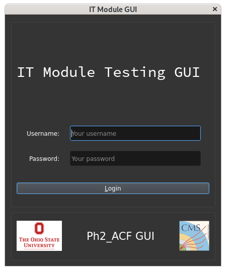
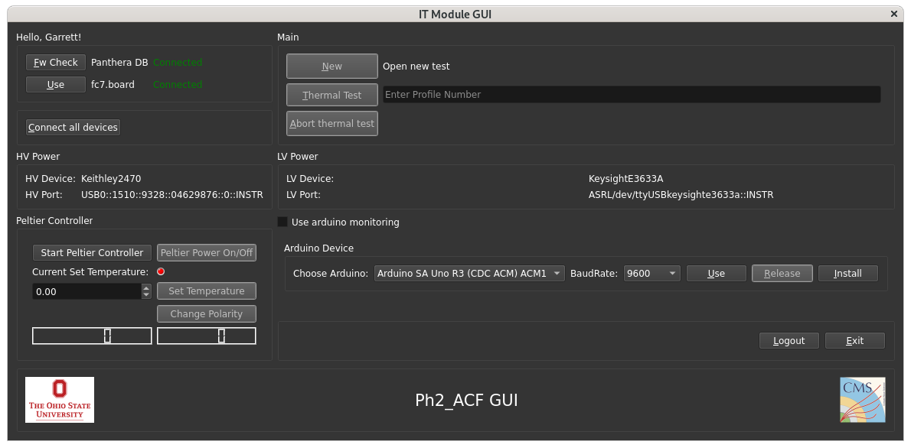
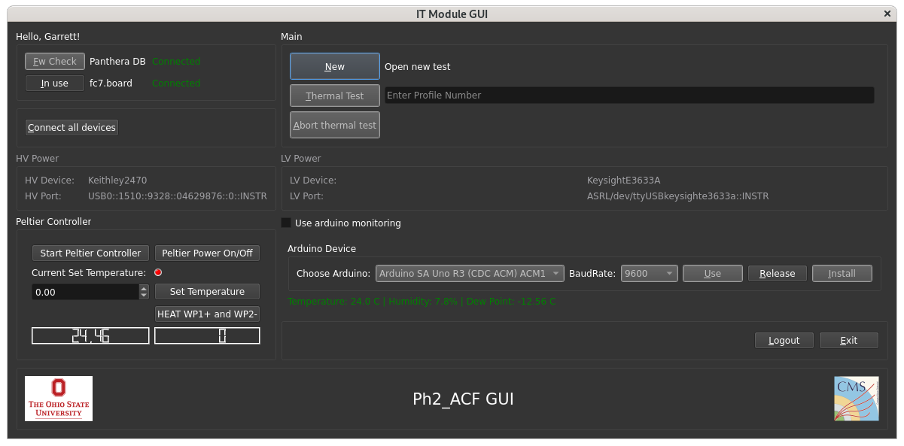
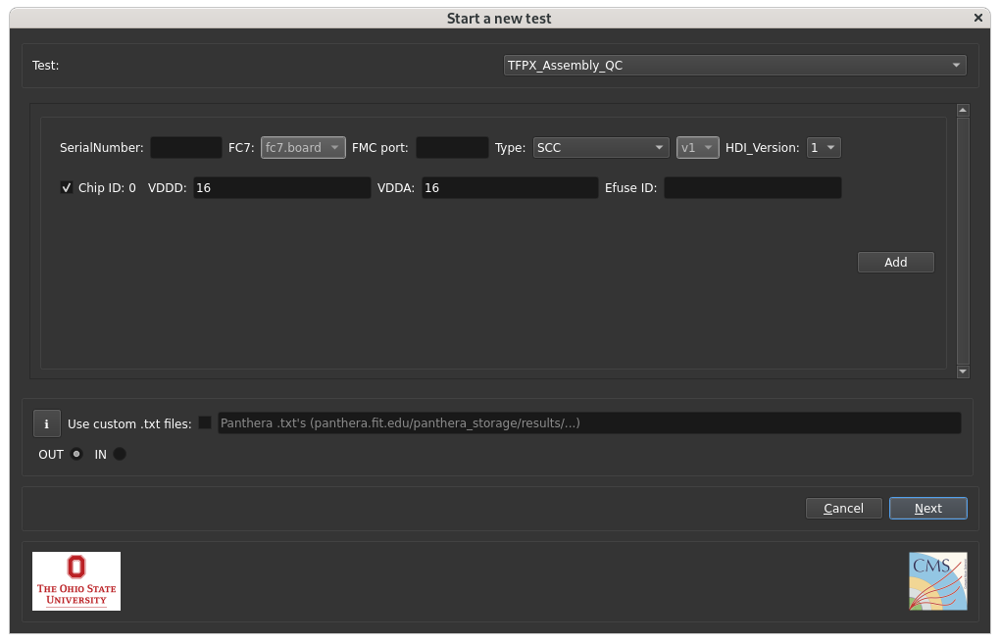
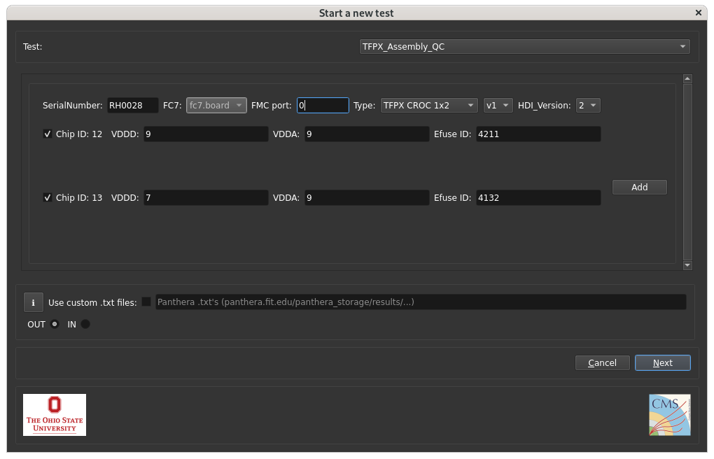

# TFPX-202 Test 1x2 CROC Module

`Introduction Placeholder`

## Required Materials

  - 1x2 CROC Module
  - 1x2 Probe Card
  - ADC Board
  - Single Module "UIC" Coldbox
  - Dry Air
  - Julabo Recirculating Chiller
  - Test Stand PC

## Procedure

### Step 1: Install Module in Cold Box

1. Gather the module and probe card from the dry air cabinent in the clean room. Be carful not to damage the pins on the probe card as you carry it to the test stand.
2. Ensure the valve connecting the coolant line to the coldbox is closed **[include picture of closed state]**. Begin cooling the coolant in the chiller. Turn the chiller on using the red button on the chiller. Using the dial, highlight temperature, and press the dial in to select. Using the dial, select 5.0 degrees Celsius as the setpoint. Press the dial to select. Select the power button in the top-right corner using the dial and press to start chilling the coolant **[need pictures of all these steps]**.
3. Ensure the Keysight E3633A low voltage supply, Keithley 2470 high voltage supply, FC7, and coldbox electronics box are powered off. There's no power button on the coldbox electronics box. Simply unplug it from the wall.
4. Remove the coldbox lid. Place the module on top of the coldplate, ensuring the screw holes on the module carrier and coldplate align. Using a 5/64" hex key (AKA Allen wrench), secure the module to the coldplate using the screw **[what kind of screw?]**. Do NOT overtighten the screw; it is okay if the module carrier can rotate slightly.
5. Place the probe card on top of the module, ensuring the probe card pins align with the pin holes on the module cover. Be careful not to bend the pins. The probe card pins should drop into the module cover with zero resistance. You should not apply any force in placing the probe card on the module.
6. Secure the probe card to the module cover using a 1/16" hex key and the screws **[what kind of screws?]**. Do not overtighten the screws.
7. Connect the ADC board to the probe card **[picture needed]**.
8. Connect the ADC board to the test stand PC using the micro-USB cable running through the side of the coldbox **[picture needed]**. There are 2 micro-USB ports on the ADC board. Connect the micro-USB cable to the port closest to you when the ports face left.
9. Connect the module to the Keysight E3633A low voltage supply using the 4-pin molex connector **[picture of molex needed]**. The clip on the male end must face up. The connector only goes in this way.
10. Connect the module to the Keithley 2470 high voltage supply using the MCX connector **[picture needed]**.
11. Connect the module to the FC7 using the micro-HDMI connector **[picutre needed]**.
12. Place the coldbox lid onto the coldbox. Secure the lid with a Phillips-head screwdriver and the 6 screws **[what kind of screws?]**. Tighten the screws in such an order as to spread out the force over the entire lid evenly as you secure it **[This doesn't make any sense, re-explain]**.

### Step 2: Cool and Dry the Coldbox

1. Turn on the Keysight E3633A low voltage supply, Keithley 2470 high voltage supply, FC7, and plug in the coldbox electronics box.
2. Launch Ph2_ACF_GUI ("OSU GUI") from the command line on the test stand PC:

    ```bash
    cd ~/Ph2_ACF_GUI **[check this is the dir name]**
    bash run_docker.sh
    ```

3. When the login screen appears, enter your Panthera credentials and click "Login". 
4. The main page should appear momentarily.  When the main page of the GUI appears, click   "Use" next to the FC7 name ("fc7.board"). Click "Connect all devices". Click the "Start Peltier Controller" in the Peltier Controller menu. This will turn on the thermometer in the peltier, which you can monitor via the number in the bottom-left corner.  Click "Use" in the Arduino Device menu. This will show the temperature, humidity, and dew point of the air in the coldbox. 
5. Turn on the dry air by tightening the brass handle connected to the dry air canister **[Need picture]**. You should see the pressure increase in the pressure gauge. 20 PSI/150 kPa of pressure is sufficient. If the pressure doesn't increase, ensure the main canister's release valve on top of the canister is open **[Need picture]**.
6. You will also need to open the valve on the air flow meter attached to the side of the coldbox **[Picutre needed]**. 8 SCFH is a suitable flow rate while bringing the dew point of the coldbox below 5°C. You should reduce the flow rate to about 2.5 SCFH once the dew point is comfortably below 5°C to save dry air while also maintainig the proper humidity.
7. Wait for the dew point to reach comfortably below 5°C. Then you may open the coolant valve to begin chilling the module.
8. Set the peliter target temperature to 5.00°C in the Peltier Controller menu on the main page of the GUI. Be sure to click "Set Temperature". Verfiy that "Current Set Temp" reads 5.0.  Click "Peltier Power On/Off" when the peltier temperature is below 10°C. You should see the temperature of the peltier rapidly drop to about 5°C. The temperature may oscillate about ±0.5°C around 5°C. This is normal.
9. You are now ready to run tests.

### Step 3: Running Tests

1. In the Main menu of OSU GUI, click "New" to open the "Start a new test" window. 
2. Enter the module serial number in the "SerialNumber" field and click out of the field. This will automatically load information relevant to the module from the Purdue database.
3. In the "FMC port" field, put 0. 
4. Select the test or series of tests you would like to run from the dropdown menu in the upper-right corner. The standard tests you should run to test a newly assembled module are the `TFPX_Assembly_QC` and `IVCurve`.
5. Click "Next" top open the Run Control Page. 
6. Check "auto-save to Panthera".
7. Click "Run" to start the test/series of tests. Be sure to monitor the temperature throughout. The module will warm up slightly **[how much is slightly?]** as the test progresses.
8. As the tests finish, you should see entries in the History table labled with the test name and a pass or fail. You can click on any failing entries to see more information about why the tests failed.
9. Once all the tests in your series finish, you can browse through plots of the test results in the menu on the right side of the Run Control Page. Because you checked "auto-save to Panthera", the results will automatically upload when all tests in the series are completed.
10. You may click "Finish" or simply close the Run Control Page once finished.

### Step 4: Warm Up Coldbox and Remove Module

1. Click "Peltier Power On/Off" on the Peltier Controller menu on the main page of the GUI.
2. Keeping the main OSU GUI page open so you can monitor the temperature and humidity, change the setpoint on the chiller to 25.0°C.
3. Looking at the peltier temperature as proxy for the module temperature, wait until the peltier temperature is near room temperature (>20°C).
4. Turn off the chiller by pressing the large red button.
5. Turn off the dry air by loosening the brass handle attached to the dry air canister. You should see the pressure drop to the minimum quickly.
6. Close the valve on the flow meter by turning the dial clockwise as far as it will go.
7. Turn off the Keysight E3633A low voltage supply, Keithley 2470 high voltage supply, FC7, and unplug the coldbox electronics box. You can also close OSU GUI.
8. Unscrew the coldbox lid and set it aside. Disconnect the micro-USB cable, MCX cable, micro-HDMI cable, and 4-pin molex connector from the module.
9. Disconnect the ADC board from the probe card and set it aside.
10. Using a 1/16" hex key, unscrew the probe card from the module. Set the screws aside and carefully lift off the probe card out of the module cover, being careful not to damage any of the pins. Set it aside.
11. Using a 5/64" hex key, unscrew the module carrier from the cold plate. Set the module aside. Rethread the screw back into the coldplate for safe keeping.
12. Carefully bring the module and the probe card into the clean room and place them in the dry air cabinet.
